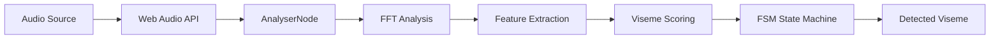
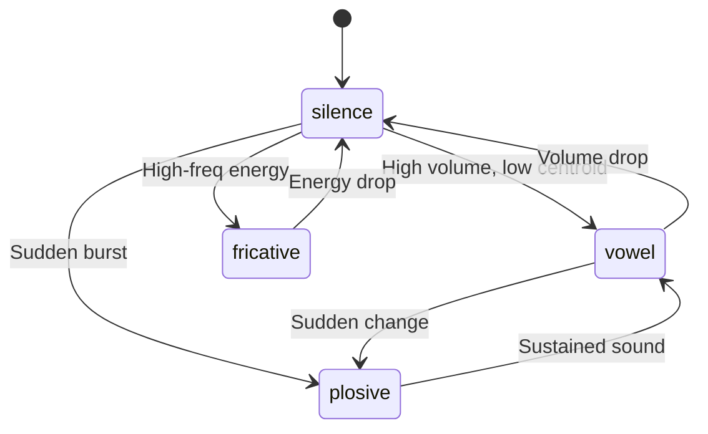

# Wawa Lipsync - Technical Documentation

A real-time lipsync library that analyzes audio frequencies to detect visemes (mouth shapes) for animating 2D/3D characters.

## Architecture Overview



## Core Components

### 1. Lipsync Class

The main entry point located in `packages/wawa-lipsync/src/lipsync.ts`.

#### Constructor Parameters

| Parameter | Type | Default | Description |
|-----------|------|---------|-------------|
| `fftSize` | number | 2048 | FFT window size for frequency analysis |
| `historySize` | number | 10 | Number of frames to average for smoothing |

#### Key Properties

```typescript
class Lipsync {
  features: Feature | null;    // Current audio features
  viseme: VISEMES;             // Currently detected viseme
}
```

---

### 2. Visemes (Mouth Shapes)

Based on [Oculus LipSync viseme set](https://developers.meta.com/horizon/documentation/unity/audio-ovrlipsync-viseme-reference/).

| Viseme | Value | Category | Description |
|--------|-------|----------|-------------|
| `sil` | `viseme_sil` | Silence | Closed mouth |
| `PP` | `viseme_PP` | Plosive | P, B, M sounds |
| `FF` | `viseme_FF` | Fricative | F, V sounds |
| `TH` | `viseme_TH` | Fricative | Th sounds |
| `DD` | `viseme_DD` | Plosive | D, T sounds |
| `kk` | `viseme_kk` | Plosive | K, G sounds |
| `CH` | `viseme_CH` | Fricative | Ch, J, Sh sounds |
| `SS` | `viseme_SS` | Fricative | S, Z sounds |
| `nn` | `viseme_nn` | Plosive | N, L sounds |
| `RR` | `viseme_RR` | Fricative | R sounds |
| `aa` | `viseme_aa` | Vowel | "ah" as in "father" |
| `E` | `viseme_E` | Vowel | "eh" as in "bed" |
| `I` | `viseme_I` | Vowel | "ee" as in "see" |
| `O` | `viseme_O` | Vowel | "oh" as in "go" |
| `U` | `viseme_U` | Vowel | "oo" as in "too" |

---

## Audio Processing Pipeline

### Step 1: Audio Connection

```typescript
lipsync.connectAudio(audioElement);
// or
await lipsync.connectMicrophone();
```

The library creates an `AudioContext` and connects the source to an `AnalyserNode`.

### Step 2: Feature Extraction

The `extractFeatures()` method performs FFT analysis and extracts:

#### Frequency Bands

| Band | Range (Hz) | Purpose |
|------|------------|---------|
| 1 | 50-200 | Low energy detection |
| 2 | 200-400 | F1 formant (lower) |
| 3 | 400-800 | F1 formant (mid) |
| 4 | 800-1500 | F2 formant (front) |
| 5 | 1500-2500 | F2/F3 formants |
| 6 | 2500-4000 | Fricative detection |
| 7 | 4000-8000 | High fricative detection |

#### Extracted Features

```typescript
interface Feature {
  bands: number[];      // Energy in each frequency band (0-1)
  deltaBands: number[]; // Rate of change per band
  volume: number;       // Overall audio volume (0-1)
  centroid: number;     // Spectral centroid (Hz)
}
```

### Step 3: Viseme Detection

The `detectState()` method uses a scoring system:

1. **Compute base scores** for each viseme based on:
   - Volume thresholds
   - Spectral centroid ranges
   - Frequency band energy patterns
   - Delta (rate of change) values

2. **Apply consistency adjustments**:
   - Boost current viseme in early phase (0-100ms)
   - Decay boost over time (100-300ms)
   - Apply penalty if held too long (>300ms)

3. **Select highest-scoring viseme**

---

## State Machine (FSM)

The library uses a Finite State Machine with 4 states:



| State | Characteristics |
|-------|-----------------|
| `silence` | Low volume (<0.2) |
| `vowel` | Sustained mid-frequency, moderate centroid |
| `plosive` | Sudden energy burst, broad centroid |
| `fricative` | High-frequency energy, high centroid |

---

## Detection Algorithms

### Silence Detection
```
IF avg.volume < 0.2 AND current.volume < 0.2 THEN viseme = sil
```

### Plosive Detection
- Triggered by sudden volume changes (`dVolume > 0.01`)
- Centroid range: 1000-8000 Hz
- Higher centroid → DD, lower → PP/nn

### Fricative Detection
- High centroid (>6000 Hz)
- Strong energy in band 6 (2500-4000 Hz)
- Positive centroid delta (>1000)

### Vowel Detection
Uses formant analysis based on band energy ratios:

| Vowel | Band Pattern |
|-------|--------------|
| aa | b4 > b3 |
| E | b2 > b3 > b4 |
| I | b3 > b2 AND b3 > b4 |
| O | Small gaps between b2, b3, b4 |
| U | b1 ≈ b2 (gap < 0.25) |

---

## Usage Example

```typescript
import { Lipsync, VISEMES } from "wawa-lipsync";

// Create instance
const lipsync = new Lipsync({ fftSize: 2048, historySize: 10 });

// Connect audio
const audio = new Audio("speech.mp3");
lipsync.connectAudio(audio);

// Process in animation loop
function animate() {
  requestAnimationFrame(animate);
  lipsync.processAudio();
  
  // Use the detected viseme
  const currentViseme = lipsync.viseme;  // e.g., "viseme_aa"
  updateCharacterMouth(currentViseme);
}

animate();
audio.play();
```

---

## Performance Considerations

| Setting | Lower Value | Higher Value |
|---------|-------------|--------------|
| `fftSize` | Faster, less accurate | Slower, more accurate |
| `historySize` | More responsive, jittery | Smoother, more latency |

**Recommended defaults**: `fftSize: 2048`, `historySize: 10`

---

## File Structure

```
packages/wawa-lipsync/src/
├── index.ts          # Exports Lipsync and VISEMES
├── lipsync.ts        # Main Lipsync class (424 lines)
├── visemes.ts        # VISEMES enum (15 visemes)
├── types.d.ts        # React Three Fiber type augmentation
└── utils/
    └── mathUtil.ts   # Average calculation helper
```
